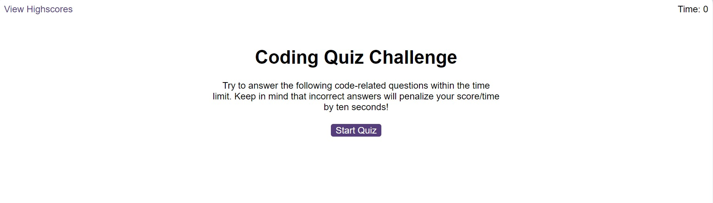
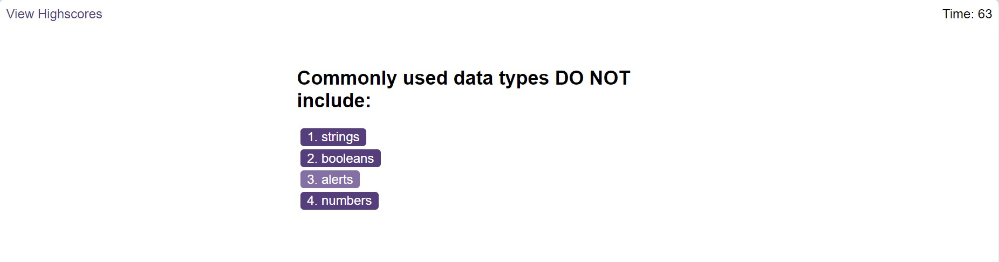
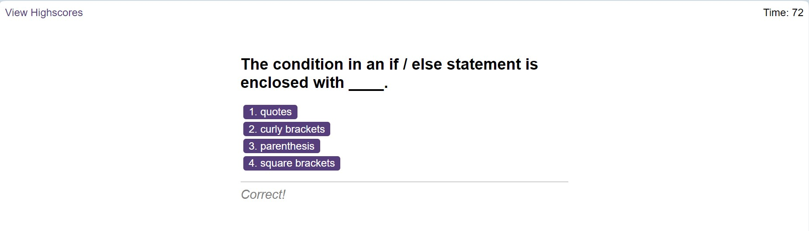
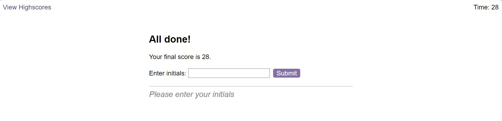

# Web-APIs-Code-Quiz

## Description

Timed coding quiz with multiple-choice questions:

Deployed application: https://iabramidze.github.io/Web-APIs-Code-Quiz/

## References

https://developer.mozilla.org/en-US/docs/Web/JavaScript/Reference/Global_Objects/Array/forEach
https://developer.mozilla.org/en-US/docs/Web/JavaScript/Reference/Global_Objects/Array/push
https://developer.mozilla.org/en-US/docs/Web/JavaScript/Reference/Global_Objects/JSON/parse